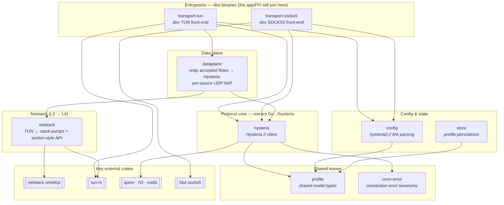

# Hysteria UI

Native [Hysteria 2](https://github.com/apernet/hysteria) client apps over a shared Rust core
(all state, logic, and protocol) with a single shared Compose Multiplatform (Kotlin) UI. Only the
thin OS-integration shims (TUN provider, secure store) are platform-specific.
Targets: macOS, Windows, Android, Android TV.

See [`PLAN.md`](PLAN.md) for the full architecture and rationale.

## Workspace structure

The Rust core is a Cargo workspace of small, single-purpose crates. Crates depend only downward;
no crate links the layer above it. The protocol core (`hysteria`) mirrors the upstream Go
implementation file-for-file and is the only crate that speaks Hysteria 2.

## Crates

| Layer | Crate | Responsibility |
| --- | --- | --- |
| Entrypoint | `transport-tun` | Dev binary: opens a `utun`, drives `dataplane` so traffic routed into the TUN is proxied. The shipped app/FFI will sit at this layer in its place. |
| Entrypoint | `transport-socks5` | Dev/standalone binary: a SOCKS5 **server** front-end (per-app proxying, no system TUN); wires `fast-socks5` commands straight to the Hysteria client. |
| Data plane | `dataplane` | Relays every flow the netstack accepts through the Hysteria client; owns the relay tasks and the per-source UDP NAT. TUN-only — SOCKS bypasses it. |
| Netstack | `netstack` | Wraps `netstack-smoltcp` + a `tun-rs` device: pumps IP packets between the TUN and the userspace stack and hands back accepted TCP streams + a UDP socket. No Hysteria knowledge. |
| Protocol core | `hysteria` | The Hysteria 2 client (QUIC via `quinn`, HTTP/3 auth via `h3`, TLS via `rustls`). Mirrors the upstream Go `../hysteria` source. |
| Config & state | `config` | Parses/builds `hysteria2://` links into profile types. |
| Config & state | `store` | Persists profiles (used by the app/FFI). |
| Shared leaf | `profile` | Shared model/value types, depended on by `config`, `store`, and `hysteria`. |
| Shared leaf | `conn-error` | Connection error taxonomy used by `hysteria`. |

## Two ingress paths, one egress

Both binaries terminate at the same `hysteria` egress but ingest traffic at different layers:

- **`transport-tun` (L3 ingress):** a TUN yields raw **IP packets**. `netstack` reconstructs them
  into L4 flows, then `dataplane` relays each flow through Hysteria.
- **`transport-socks5` (L4 ingress):** SOCKS5 delivers transport-layer intent directly (`CONNECT`,
  `UDP ASSOCIATE`), so it needs neither a netstack nor `dataplane`.
